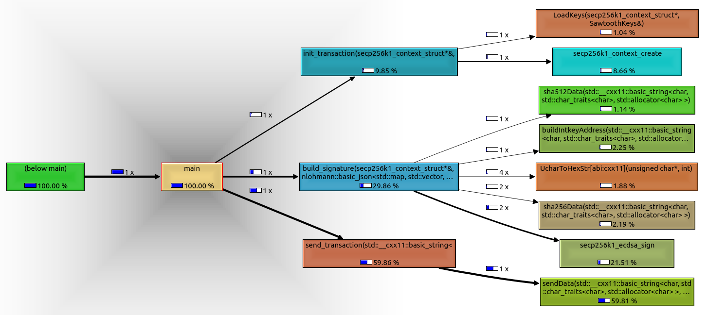

# Hyperledger Sawtooth C++ Client Application

This program aims to demonstrate that it is possible to run a client application in C++ for Hyperledger Sawtooth blockchain.

I profile this program to have an overview of the most required functions used in an Hyperledger Sawtooth client application.

Please make an issue for questions or errors.

## Important

Pull submodules !
```
git submodule update --init --recursive
```

## Requirements: 

Run the `setup.sh` or follow the next commands to build required libs.

Make Secp256k1:
```bash

cd secp256k1/
./autogen.sh
./configure --enable-module-recovery --without-bignum
make
cd ..

```
Make cryptopp:
```bash

cd cryptopp/
make
cd ..

```

Make protobuf:
```
cd protobuf/
git submodule update --init --recursive
./autogen.sh
./configure --prefix=$(pwd)/.libs/ --disable-shared
make
make install
cd ..

```

## Make the app

To build the app just:

```
make
./app 
```


## Steps to send a transaction

Here is a simple description of the steps inside the program:

- [x] init transaction
- [x] build transaction (using protobuf) & sign transaction (secp256k1)
- [x] push_transaction

*Checked items are currently done.

## Profiling

### With Valgrind/Callgrind

**Note**: Compile without -pg . Also make sure to REMOVE *gperftools* include with `ProfilerStart` and `ProfilerStop`.

```
#Run the program:
valgrind --tool=callgrind ./app --push inc

#Visualize:
kcachegrind <previous file output>
```



### with gperftools/pperf

**Note**: Compile without -pg . Also make sure to ADD *gperftools* include with `ProfilerStart` and `ProfilerStop`.

It seems the program is to fast for gperftools. You still can get some results with `CPUPROFILE_REALTIME=1` .

```
#Run the program:
CPUPROFILE_REALTIME=1 CPUPROFILE_FREQUENCY=10000000 LD_PRELOAD=/usr/local/lib/libprofiler.so.0.5.0 ./app --push inc

#Visualize:
./pprof -kcachegrind ./app ./profile.txt

```

**Note**: to install gperftools/pperf:
```
#For gperftools:
git clone https://github.com/gperftools/gperftools.git
./autorun.sh
./configure
make
sudo make install

#For pperf:
go get -u github.com/google/pprof
#Or:
git clone https://github.com/google/pprof.git
cd pprof && go build
```


## Acknowledgement

This work has been supported by the French government, through the U CA JEDI and EUR DS4H Investments in the Future projects managed by the National Research Agency (ANR) with the reference number ANR-15-IDEX-0001 and ANR-17-EURE-0004.